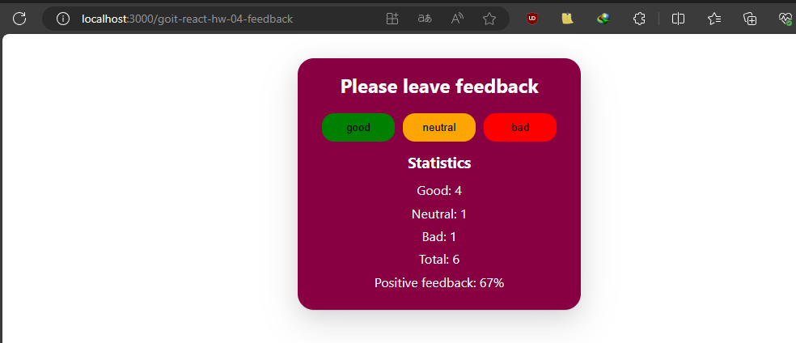

**Read in other languages: [english](README.md), [polish](README.pl.md).**

# Feedback Widget

Like most companies, Expresso Cafe collects reviews from its customers. Your
task is to create an application to collect statistics. There are only three
options for feedback: good, neutral, and bad.

## Appearance



## Installation

To run the Feedback Widget application locally, follow these steps:

1. Clone the repository:

   ```bash
   git clone [repository-url]

   ```

2. Change to the project directory:

   ```bash
   cd [repository-name]

   ```

3. Install and start dependencies:
   ```bash
   npm install
   npm run dev
   npm start
   ```

The application should now be accessible in your web browser at
http://localhost:3000.

## How it works

The main component is **App**, defined in **App.jsx**.
