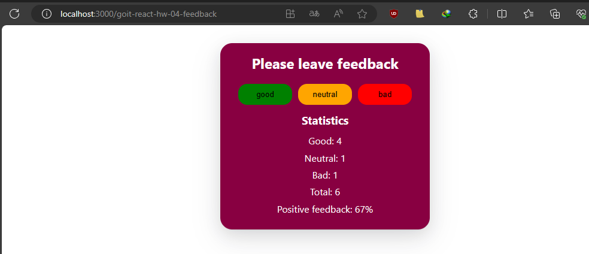

**Przeczytaj w innych językach: [angielski](README.md),
[polski](README.pl.md).**

# Feedback Widget

Jak większość firm, kawiarnia Expresso zbiera feedback od swoich klientów. Twoim
zadaniem jest stworzenie aplikacji dla zbierania statystyk. Są tylko trzy
warianty odpowiedzi: dobry, neutralny, zły.

## Wygląd



## Instalacja

Aby uruchomić aplikację Image Finder lokalnie, wykonaj następujące kroki:

1. Sklonuj repozytorium:

   ```bash
   git clone [adres repozytorium]
   ```

2. Przejdź do katalogu projektu:

   ```bash
   cd [nazwa-repozytorium]
   ```

3. Zainstaluj i uruchom zależności:
   ```bash
   npm install
   npm run dev
   npm start
   ```

Aplikacja powinna być teraz dostępna w Twojej przeglądarce internetowej pod
adresem http://localhost:3000.

## Jak to działa

Głównym komponentem jest **App** zdefiniowana w **App.jsx**.
